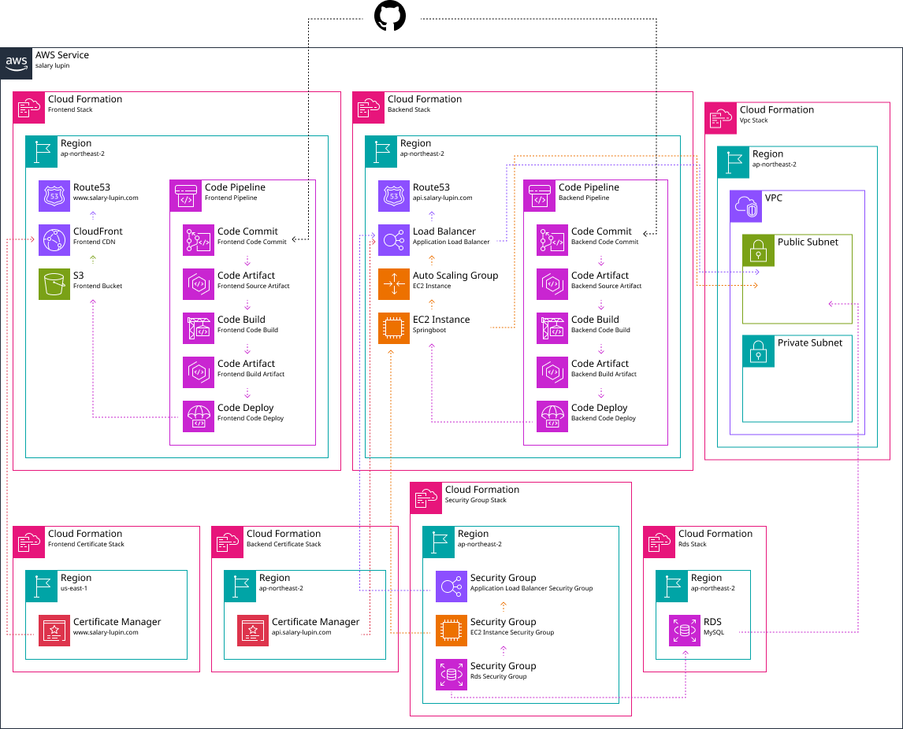

**Salary Lupin은 ‘일하지 않기 위해 일하는’ 사람들을 위한 플랫폼입니다.**  
이곳은 진짜로 아무 일도 하지 않으면서, 일하는 척은 아주 그럴듯하게 할 수 있는 공간입니다.

집중은 흐트러지고, 할 일은 애매하고, 회의는 끝나지 않습니다.  
그렇다고 탭을 닫기도 뭔가 애매한 이 순간,  
우리는 브라우저를 열어 무언가를 해야만 합니다.

Salary Lupin은 그럴 때 켜는 **가장 진지한 가벼움**입니다.  
한 번 들어오면 누구나 월급루팡, 한 번 웃고 나면 다시 직장인.  
일과 유희의 중간쯤에서, 우리는 당신의 월급루팡을 돕습니다.

[🔗 웹 사이트 바로가기](https://www.salary-lupin.com)

<br>

## 👉 레포지토리는 이렇게 운영됩니다.

Salary Lupin의 전체 인프라를 정의한 **IaC(Infrastructure as Code) 프로젝트**입니다.  
[프론트엔드](https://github.com/geist9110/salary-lupin-fe)
와 [백엔드](https://github.com/geist9110/salary-lupin-be)는 각각 별도의 저장소에서 관리되며, 인프라는 두 서비스를 통합하고, 개발-운영
환경(dev/prod) 분리를 기반으로 실제 운영이 가능한 클라우드 아키텍처를 구성합니다.

<details>
<summary>디렉토리 설명</summary>

| 디렉토리            | 설명                                  |
|-----------------|-------------------------------------|
| `apps`          | 백엔드와 프론트엔드의 전체 스택을 구성하는 진입점         |
| `cdn`           | 정적 파일 배포용 CloudFront 구성             |
| `cert`          | ACM 인증서 발급 및 관리                     |
| `cicd`          | GitHub 기반 자동 배포용 CodePipeline 설정    |
| `common`        | 환경 공통 파라미터 및 인터페이스 정의               |
| `compute`       | EC2, ALB, Auto Scaling 등 서버 컴포넌트 관리 |
| `dns`           | Route53을 통한 도메인 및 레코드 설정            |
| `iam`           | IAM Role 및 권한 설정 (EC2 등)            |
| `network`       | VPC, Subnet, NAT Gateway 등 네트워크 설정  |
| `securityGroup` | ALB, EC2, RDS에 대한 보안 그룹 구성          |
| `storage`       | 정적 파일용 S3, RDS 등 저장소 리소스 설정         |
| `util`          | 공통 태그, 유틸 함수 등 재사용 모듈               |

</details>

<br>

## 🧱 인프라는 이렇게 생겼습니다.



> 화살표는 **리소스 간의 흐름**을 의미합니다.  
> A에서 B로 향하는 화살표는 **A리소스가 B리소스에서 사용**되고 있다는 의미입니다.  
> 이때 **화살표의 색상은 출발 지점의 색상**에 맞춰 표시됩니다.

<details>
<summary>스택 설명</summary>

| 스택                       | 설명                  | 역할                                       |
|--------------------------|---------------------|------------------------------------------|
| FrontendStack            | 프론트엔드 리소스를 관리하는 스택  | S3, CloudFront, CodePipeline, www 레코드 생성 |
| BackendStack             | 백엔드 리소스를 관리하는 스택    | ALB, ASG, CodePipeline, api 레코드 생성       |
| VpcStack                 | 네트워크 구성을 위한 스택      | 퍼블릭/프라이빗 서브넷이 포함된 VPC 생성                 |
| FrontendCertificateStack | 프론트엔드용 인증서를 관리하는 스택 | CloudFront용 ACM 인증서 발급                   |
| BackendCertificateStack  | 백엔드용 인증서를 관리하는 스택   | ALB용 ACM 인증서 발급                          |
| SecurityGroupStack       | 보안 그룹을 관리하는 스택      | ALB, EC2, RDS용 Security Group 생성         |
| RdsStack                 | 데이터베이스 리소스를 관리하는 스택 | MySQL RDS 인스턴스 생성                        |

</details>

<br>

## 📦 환경은 이렇게 구성돼야 해요.

`.env` 파일은 `env/dev.env`, `env/prod.env`처럼 환경별로 나눠서 사용합니다.

<details>
<summary>환경 변수</summary>

| 변수명                   | 설명                            | 예시               | 필수 |
|-----------------------|-------------------------------|------------------|----|
| DOMAIN_NAME           | 사용할 도메인의 이름                   | salary-lupin.com | ✅  |   
| HOSTED_ZONE_ID        | 도메인의 hosted zone id           | -                | ✅  |     
| ACCOUNT_ID            | 배포할 계정의 id                    | -                | ✅  |
| APP_NAME              | 배포할 어플리케이션의 이름                | salarylupin      | ✅  |     
| RDS_USER_NAME         | RDS root 사용자 이름               | root             | ✅  |     
| GITHUB_CONNECTION_ARN | Github App을 통한 connection arn | -                | ✅  |  
| GITHUB_OWNER          | Github 사용자 이름                 | geist9110        | ✅  |     
| GITHUB_REPO_FRONTEND  | Github Frontend Repo 이름       | salary-lupin-fe  | ✅  |     
| GITHUB_REPO_BACKEND   | Github Backend Repo 이름        | salary-lupin-be  | ✅  |    
| GITHUB_BRANCH         | Github에 배포할 브랜치 이름            | main             | ✅  |
| KEY_PAIR_NAME         | EC2에 접속할 key pair 이름          | -                | ❌  |

</details>

<br>

## 🚀 배포는 이렇게 합니다.

1. AWS CLI 인증

```bash
aws configure
```

2. CDK CLI 설치

```bash
npm install -g aws-cdk
```

3. 라이브러리 설치

```bash
npm install
```

4. 배포 진행

```bash
NODE_ENV=[env] npm run cdk:deploy -- [스택 ID]
```

> --[스택 ID]는 CDK에서 배포할 특정 스택 이름을 명시할 때 사용합니다.  
> [env]는 CDK에서 배포할 환경의 이름을 명시할 때 사용합니다.  
> ex: NODE_ENV=prod npm run cdk:deploy --Frontend-Stack-prod
